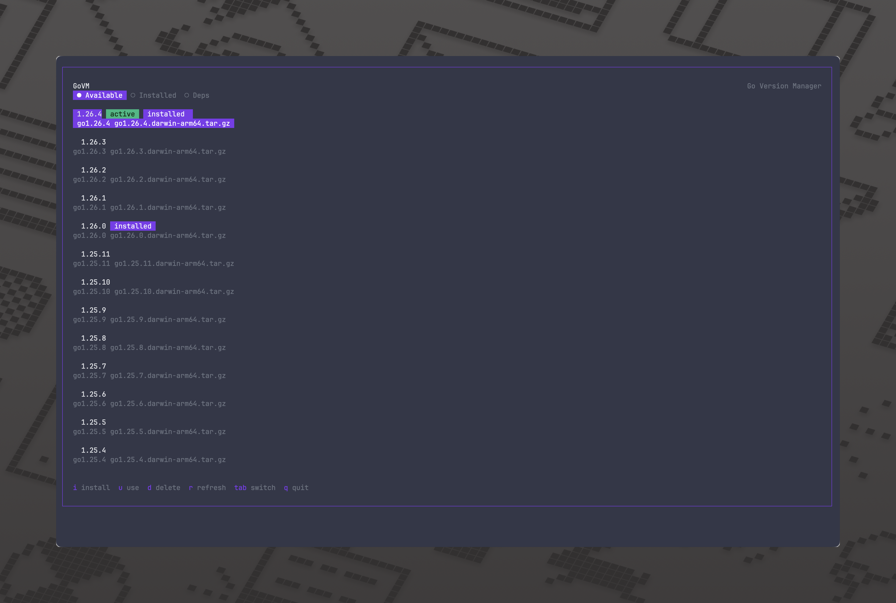

# GoVM - Go Version Manager

> **Fork** of [Melkeydev/govm](https://github.com/melkeydev/govm). Original repository: [github.com/melkeydev/govm](https://github.com/melkeydev/govm)

GoVM is a modern tool for managing multiple Go versions on your system. It features both a clean Terminal UI (TUI) and a command-line interface for easy installation and switching between Go versions.

## Features

- Beautiful TUI built with [Charm Bubbletea v2](https://charm.land/bubbletea/v2) with responsive layout
- Command-line interface for quick operations
- Install any available Go version directly from go.dev
- Switch between installed versions with a single command
- Delete installed versions (with safety check for the active version)
- Supports partial version numbers (e.g., `1.21` for latest 1.21.x) and `go` prefix (e.g., `go1.21`)
- Go module dependency viewer and updater built into the TUI
- Works on macOS, Linux, and Windows (darwin/linux/windows, amd64/arm64)

## Installation

### Prerequisites

- Go 1.26 or higher

### Install

```bash
go install github.com/smileoniks-ctrl/govm@latest
```

Then in a new terminal run:

```bash
govm
```

To launch the TUI

## First-Time Setup

When you first run GoVM, it will guide you through adding the required directory to your PATH. This is a one-time setup that enables GoVM to manage your Go versions.

### On Linux/macOS

Add this to your shell configuration file (~/.bashrc, ~/.zshrc, etc.):

```bash
export PATH="$HOME/.govm/shim:$PATH"
```

Or run this command to add it automatically:

```bash
echo 'export PATH="$HOME/.govm/shim:$PATH"' >> ~/.bashrc  # or ~/.zshrc
```

Then reload your shell configuration:

```bash
source ~/.bashrc  # or whichever file you modified
```

### On Windows

Add the shim directory to your PATH:

```cmd
setx PATH "%USERPROFILE%\.govm\shim;%PATH%"
```

Then restart your terminal.

## Usage

GoVM can be used in two ways: via the interactive TUI or through command-line commands.

### Terminal User Interface (TUI)

Launch the interactive TUI by running govm without arguments:

```bash
govm
```

The TUI has three tabs that you cycle through with `Tab`:

- **Available** - all Go versions available for download from go.dev
- **Installed** - Go versions installed locally on your system
- **Deps** - Go module dependencies of the current working directory

#### Navigation

| Key | Action |
|---|---|
| `Tab` | Cycle between Available, Installed, and Deps tabs |
| `i` | Install the selected version (Available tab) |
| `u` | Switch to the selected version (Available/Installed tabs), or update dependencies (Deps tab) |
| `d` | Delete the selected installed version with confirmation (Available/Installed tabs) |
| `r` | Refresh available versions (Available tab), or check for dependency updates (Deps tab) |
| `q` | Quit |

When deleting a version, you will be prompted to confirm with `y` or cancel with `n`. The active version cannot be deleted.

### Command Line Interface

Version strings accept an optional `go` prefix (e.g., `go1.21` is equivalent to `1.21`). Partial versions like `1.21` resolve to the latest patch release.

```bash
# Install a Go version (latest patch for the specified version)
govm install 1.21  # Installs the latest Go 1.21.x

# Switch to a Go version
govm use 1.20      # Switches to the latest installed Go 1.20.x

# Delete an installed Go version (prompts for confirmation; cannot delete the active version)
govm delete 1.20

# List installed versions
govm list

# Print govm version
govm version

# Show help and version information
govm help

# Launch the TUI
govm
```

### Go Dependencies Tab

The **Deps** tab in the TUI displays the Go module dependencies of the current working directory. It reads dependencies via `go list -mod=readonly -m -json all` and shows:

| Column | Description |
|---|---|
| Dependency | Module path |
| Current | Currently pinned version |
| Latest | Latest available version (after refresh) |
| Status | `current`, `update avail`, `indirect`, `deprecated`, or `error` |

- Press `r` on the Deps tab to check for available updates online.
- Press `u` on the Deps tab to update all direct dependencies with available updates. A confirmation dialog appears before running `go get` and `go mod tidy`.

## How It Works

GoVM downloads Go versions from the official go.dev website and installs them in `~/.govm/versions`. It uses a "shim" approach:

- It creates wrapper scripts in `~/.govm/shim` that point to the selected Go version
- When you run `go` or other Go commands, these wrappers execute the proper version
- Switching versions simply updates these wrappers to point to a different installation
- The currently active version is tracked in `~/.govm/active_version`
- Downloaded archives are temporarily stored in `~/.govm/downloads` and cleaned up after extraction

This ensures a seamless experience without needing to manually update environment variables or source scripts each time you switch versions.

### Install from source

```bash
# Clone the repository
git clone https://github.com/smileoniks-ctrl/govm.git
cd govm

# Build and install
go build -o govm
```

Then place the binary somewhere in your PATH.

### Homebrew

Add Homebrew repository to the system:

```bash
brew tap smileoniks-ctrl/tap
```

You can then install your package with:

```bash
brew install govm
```

## Dependencies

- [Charm Bubbletea v2](https://charm.land/bubbletea/v2) - Terminal UI framework
- [Charm Bubbles v2](https://charm.land/bubbles/v2) - UI components
- [Charm Lipgloss v2](https://charm.land/lipgloss/v2) - UI styling
