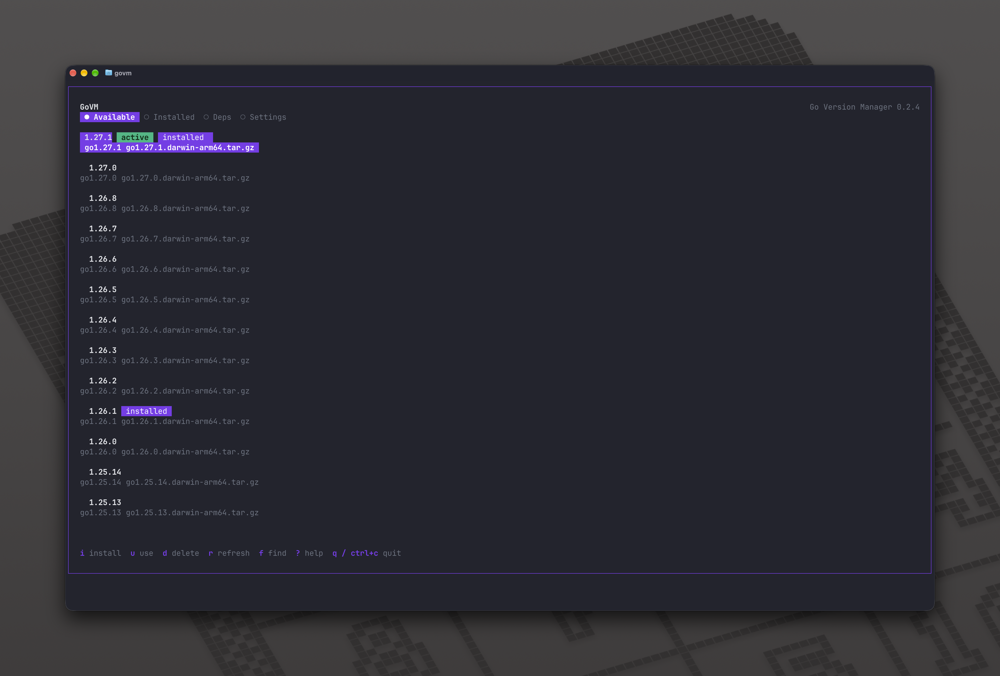

# GoVM - Go Version Manager

> [!NOTE]
> **govm** is a fork of [govm](https://github.com/melkeydev/govm). by MelkeyDev.
> As the original project appears to be inactive, I'm endeavoring to sustain its vitality by meticulously rectifying its flaws.


GoVM is a modern tool for managing multiple Go versions on your system. It features both a clean Terminal UI (TUI) and a command-line interface for easy installation and switching between Go versions.

## Features

- Beautiful TUI built with [Charm Bubbletea v2](https://charm.land/bubbletea/v2) with a responsive layout that adapts to your terminal size (normal and wide breakpoints) and a minimum viewport of 64x20
- Version string shown in the TUI header and CLI help output
- Command-line interface for quick operations
- Install any available Go version directly from go.dev
- Switch between installed versions with a single command
- Delete installed versions (with safety check for the active version)
- Supports partial version numbers (e.g., `1.21` for latest 1.21.x) and `go` prefix (e.g., `go1.21`)
- Go module dependency viewer built into the TUI
- Dependency update flow with a pre-update snapshot, optional `go test ./...` and `go vet ./...` checks, and one-key rollback to the pre-update state if checks fail
- Dependency backup management: each update snapshots `go.mod` and `go.sum`, and the TUI and CLI can list, restore, and prune those snapshots
- Settings tab with a dependency display filter (`Direct only` / `All`), runtime theme switching (`Current` / `Light`), and a configurable dependency backup retention limit
- Settings persist between sessions and are stored in a platform-specific config file
- Resilient error handling: the TUI remains responsive (and closable) when go.dev is unreachable
- Enforced minimum terminal viewport of 64x20; below that, a centred warning explains the required size
- Works on macOS, Linux, and Windows (darwin/linux/windows, amd64/arm64)

## Installation

### Prerequisites

- Go 1.26.1 or higher

### Install

```bash
go install github.com/smileoniks-ctrl/govm@latest
```

Then in a new terminal run:

```bash
govm
```

To launch the TUI

## First-Time Setup

When you first run GoVM, it will guide you through adding the required directory to your PATH. This is a one-time setup that enables GoVM to manage your Go versions.

### On Linux/macOS

Add this to your shell configuration file (~/.bashrc, ~/.zshrc, etc.):

```bash
export PATH="$HOME/.govm/shim:$PATH"
```

Or run this command to add it automatically:

```bash
echo 'export PATH="$HOME/.govm/shim:$PATH"' >> ~/.bashrc  # or ~/.zshrc
```

Then reload your shell configuration:

```bash
source ~/.bashrc  # or whichever file you modified
```

### On Windows

Add the shim directory to your PATH:

```cmd
setx PATH "%USERPROFILE%\.govm\shim;%PATH%"
```

Then restart your terminal.

## Usage

GoVM can be used in two ways: via the interactive TUI or through command-line commands.

### Terminal User Interface (TUI)

Launch the interactive TUI by running govm without arguments:

```bash
govm
```

The TUI has four tabs that you cycle through with `Tab` (forward) and `Shift+Tab` (backward):

- **Available** - all Go versions available for download from go.dev
- **Installed** - Go versions installed locally on your system
- **Deps** - Go module dependencies of the current working directory
- **Settings** - dependency display filter, theme toggle, and the dependency backup retention limit

The TUI layout is responsive and adjusts to your terminal width:

| Width | Mode | Behavior |
|---|---|---|
| `< 64` (or height `< 20`) | Minimum viewport | Centred warning explaining the required 64x20 size; the rest of the UI is hidden until the terminal is resized |
| `64-129` | Normal | Bordered layout, full tab labels and help hints |
| `>= 130` | Wide | Larger padding, full borders |

The TUI header shows the GoVM version so you always know which build is running.

#### Navigation

| Key | Action |
|---|---|
| `Tab` | Cycle forward between Available, Installed, Deps, and Settings tabs |
| `Shift+Tab` | Cycle backward to the previous tab (wraps from Available to Settings) |
| `i` | Install the selected version (Available tab) |
| `u` | Switch to the selected version (Available tab) or update direct dependencies (Deps tab) |
| `d` | Delete the selected installed version with confirmation (Available/Installed tabs) |
| `r` | Refresh available versions from go.dev (Available tab) or check for dependency updates online (Deps tab) |
| `b` | List saved dependency backups and choose one to restore (Deps tab) |
| `↑/↓`, `k/j` | Move the cursor between settings (Settings tab) or between dependency backups in the restore dialog |
| `enter`/`space` | Toggle the highlighted setting (Settings tab); on the Deps backups row it opens a numeric input dialog |
| `←/→`, `h/l` | Toggle the highlighted setting (Settings tab); on the Deps backups row they bump the limit by 1 |
| `q`, `ctrl+c` | Quit |

When deleting a version, you will be prompted to confirm with `y` or cancel with `n`. The active version cannot be deleted.

Confirmation dialogs (for dependency updates, post-update checks, and rollback) use the following keys:

| Key | Action |
|---|---|
| `←/→`, `Tab`/`Shift+Tab`, `h/l` | Switch the highlighted choice |
| `enter` | Confirm the highlighted choice |
| `y` | Accept |
| `n` / `esc` | Cancel or skip (context dependent) |

### Command Line Interface

Version strings accept an optional `go` prefix (e.g., `go1.21` is equivalent to `1.21`). Partial versions like `1.21` resolve to the latest patch release.

```bash
# Install a Go version (latest patch for the specified version)
govm install 1.21  # Installs the latest Go 1.21.x

# Switch to a Go version
govm use 1.20      # Switches to the latest installed Go 1.20.x

# Delete an installed Go version (prompts for confirmation; cannot delete the active version)
govm delete 1.20

# List installed versions
govm list

# Print govm version
govm version

# Show help and version information
govm help

# Launch the TUI
govm
```

The `govm help` and `govm version` commands print the current GoVM version so you can confirm which build is installed.

### Go Dependencies Tab

The **Deps** tab in the TUI displays the Go module dependencies of the current working directory. It reads dependencies via `go list -mod=readonly -m -json all` and shows:

| Column | Description |
|---|---|
| Dependency | Module path |
| Current | Currently pinned version |
| Latest | Latest available version (after refresh) |
| Status | `current`, `update avail`, `indirect`, `indirect update`, `deprecated`, or `error` |

The Deps table mirrors the data in the **Installed** tab, which shows three columns: **Version**, **Path**, and **Status** (where Status is `active` for the version currently wired through the shim).

#### Refreshing and updating dependencies

| Key | Action |
|---|---|
| `r` | Check for available updates online (runs `go list -u`) |
| `u` | Open the dependency update confirmation dialog |
| `b` | List saved dependency backups and choose one to restore |

Pressing `u` on the Deps tab opens a confirmation dialog that lists every direct dependency that will be upgraded, e.g.:

```
⚠ Warning

3 direct dependencies will be updated:
  github.com/foo/bar: v1.2.3 -> v1.3.0
  github.com/baz/qux: v0.4.1 -> v0.5.0
  …and 1 more

go.mod and go.sum will be modified.
A snapshot is taken before the update so changes can be rolled back.
```

Once you confirm, GoVM:

1. Snapshots `go.mod` and `go.sum`.
2. Runs `go get` for each direct dependency that has an update, then `go mod tidy`.
3. Refreshes the dependency list and shows a **Run checks?** dialog with the default choice set to **Yes**:
   ```
   ✓ Run checks?

   After the update the following will be executed:
     • go test ./...
     • go vet ./...

   If a check fails you will be offered to roll back the dependencies.
   ```
4. If you accept, runs `go test ./...` and `go vet ./...` in the module directory.
   - On success, GoVM reports `Checks passed.` and the updated table is kept.
   - On failure, GoVM opens a **Rollback** dialog that shows the failing command and a trimmed excerpt of its output. Choosing **Roll back** restores `go.mod` and `go.sum` from the snapshot, runs `go mod tidy`, and refreshes the dependency list. Choosing **Keep** dismisses the dialog and leaves the updated files in place.

`esc` cancels or skips each dialog, and you can quit at any time with `q`/`ctrl+c`.

#### Go dependency commands

The same dependency workflow is also available from the command line as
`govm deps <list|check|update|backups|restore>`. The commands run in the current working
directory and follow the same snapshot/update/checks/rollback model that
the TUI uses.

```bash
# List current module dependencies
govm deps list

# Check for available updates (no changes)
govm deps check

# Interactively update direct dependencies, run checks, and roll back
# on failure (mirrors the TUI Deps tab)
govm deps update

# List saved dependency backups for the current module
govm deps backups

# Restore a backup listed by `govm deps backups`
govm deps restore <file>
```

`govm deps update` prompts for confirmation before each step. The default
for every prompt is `Y` (yes), including the rollback prompt, matching
the TUI behaviour where the safe option is the default.

Backup filenames are listed by `govm deps backups` and are stored under
`~/.govm/deps_backup` in a module-specific directory. Before restoring a
backup, GoVM saves the current `go.mod` and `go.sum` as a pre-restore backup,
so the restore can be undone manually.

### Settings

The **Settings** tab lets you customise GoVM's behaviour. Settings are saved automatically whenever you change them and persist between sessions.

| Setting | Values | Default | Effect |
|---|---|---|---|
| Deps display | `Direct only` / `All` | `Direct only` | Controls which dependencies are shown on the Deps tab. `Direct only` hides indirect dependencies; `All` shows every dependency. |
| Theme | `Current` / `Light` | `Current` | Switches the TUI colour palette. `Current` is the dark theme; `Light` is a light-background theme. The change is applied immediately. |
| Deps backups | `1`-`100` | `10` | Maximum number of dependency backups retained per module. The newest backup is always kept; the oldest are pruned when the limit is exceeded. |

#### Navigating the Settings tab

| Key | Action |
|---|---|
| `↑/↓`, `k/j` | Move the cursor between settings |
| `enter`, `space` | Toggle the highlighted setting; on the Deps backups row it opens a numeric input dialog |
| `←/→`, `h/l` | Toggle the highlighted setting; on the Deps backups row they bump the limit by 1 (wrapping at the bounds) |
| `tab` / `shift+tab` | Switch to the next / previous tab |

#### Editing the backup limit

Pressing `enter` on the **Deps backups** row opens a small dialog that asks for a whole number between `1` and `100`. The dialog supports `enter` to save and `esc` to cancel, and shows an inline error when the value is empty, not numeric, or out of range. Toggling the setting with `←/→` (or `h`/`l`) cycles the value by one, wrapping from `1` to `100` and back.

#### Settings file location

Settings are stored in `settings.json` inside the GoVM home directory:

| OS | Path |
|---|---|
| Linux / macOS | `~/.govm/settings.json` |
| Windows | `%USERPROFILE%\.govm\settings.json` |

The file is written atomically (temp file + rename) and is safe to edit manually. On startup GoVM loads the saved theme and applies it before the TUI is rendered.

#### Migrating existing settings

If you are upgrading from an older govm, your `settings.json` lives in the platform user config directory (`~/.config/govm/settings.json` on Linux, `~/Library/Application Support/govm/settings.json` on macOS, `%AppData%\govm\settings.json` on Windows). The first launch of the new govm automatically moves that file to `~/.govm/settings.json` and removes the old copy. No manual action is required.

## How It Works

GoVM downloads Go versions from the official go.dev website and installs them in `~/.govm/versions`. It uses a "shim" approach:

- It creates wrapper scripts in `~/.govm/shim` that point to the selected Go version
- When you run `go` or other Go commands, these wrappers execute the proper version
- Switching versions simply updates these wrappers to point to a different installation
- The currently active version is tracked in `~/.govm/active_version`
- Downloaded archives are temporarily stored in `~/.govm/downloads` and cleaned up after extraction
- User settings (theme, deps display filter, and the dependency backup retention limit) are stored in `~/.govm/settings.json` (see [Settings](#settings))
- Dependency update snapshots and restores live in `~/.govm/deps_backup`, organised by module path

This ensures a seamless experience without needing to manually update environment variables or source scripts each time you switch versions.

### Install from source

```bash
# Clone the repository
git clone https://github.com/smileoniks-ctrl/govm.git
cd govm

# Build and install
go build -o govm
```

Then place the binary somewhere in your PATH.

### Homebrew

Add Homebrew repository to the system:

```bash
brew tap smileoniks-ctrl/tap
```

You can then install your package with:

```bash
brew install --cask govm
```

## Dependencies

- [Charm Bubbletea v2](https://charm.land/bubbletea/v2) - Terminal UI framework
- [Charm Bubbles v2](https://charm.land/bubbles/v2) - UI components
- [Charm Lipgloss v2](https://charm.land/lipgloss/v2) - UI styling
